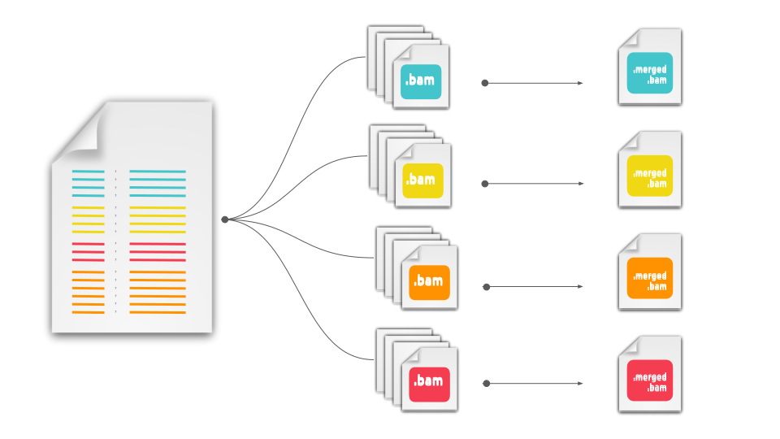

```diff
---------  Under construction!  ---------
```

# merge-bams-nf 
Minimal nextflow pipeline to merge technical replicates from BAM files
<br><br><br>

<p align="center">
  
</p>


## Quick Start

Required Arguments:

| argument       | value | 
|:--------------:|:-----:| 
| <kbd>`input_files_list`</kbd>| a file like [this](example-input/input_files_list.csv) to denote file groups for merging | 
|  <kbd>`tool `</kbd>  | one of `samtools` or `sambamba` to select tool |

To test the pipeline with the example input you can run:

```nextflow
# Clone the repository
git clone https://github.com/cgpu/merge-bams-nf.git

# cd into the repo folder 
cd merge-bams-nf

# Execute nextflow run command with example input parameters
nextflow run cgpu/merge-bams-nf --input_files_list example-input/input_files_list.csv  --tool 'samtools' 
```

